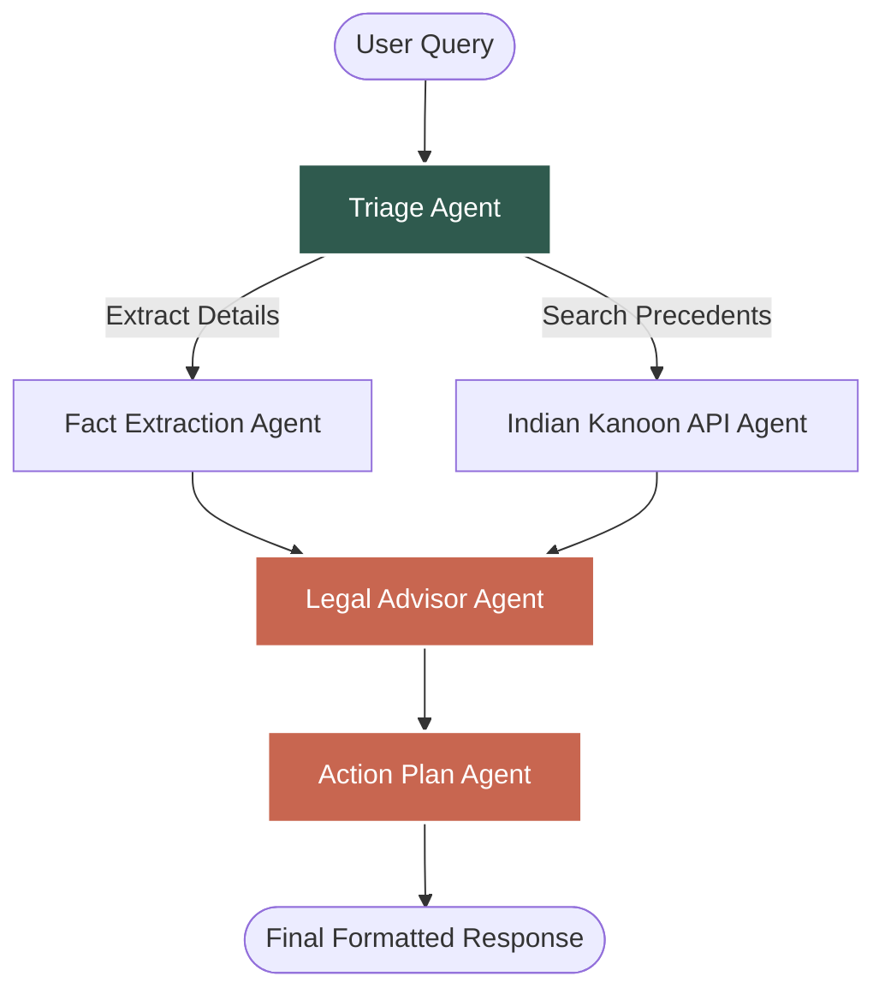

# ⚖️ Nyaya AI

Nyaya AI is an intelligent, agentic legal assistant designed to help Indian citizens navigate their legal rights, draft official documents, and get actionable legal advice. Powered by **LangGraph** and an advanced multi-agent architecture, Nyaya AI breaks down complex situations into plain, easy-to-understand guidance.

 

---

## ✨ Features

- **Multi-Agent Legal Chatbot**: A state-of-the-art conversational AI that maintains memory across chats. It automatically analyzes your story, extracts facts, searches legal databases, and generates a structured action plan.
- **RTI Drafting Wizard**: A step-by-step wizard to file Right to Information (RTI) applications.
- **✨ Refine with AI**: Type a messy, raw request into the RTI drafter and let the AI instantly rewrite it into a highly formal, specific, and legally sound numbered list.
- **Contextual Prompt Starters**: Jump right into specific topics (Tenant Rights, Consumer Complaints, etc.) with pre-configured, context-aware AI greetings.
- **Beautiful UI**: A clean, spacious, glassmorphic frontend built with React, featuring full Markdown support for beautiful, clickable legal citations.

---

## 🧠 Multi-Agent Architecture (LangGraph)

Nyaya AI isn't just a simple prompt wrapper. It uses a **Directed Acyclic Graph (DAG)** to route your legal query through specialized AI agents, ensuring high-quality, verified advice. 



### Agent Roles:
1. **Triage Agent**: Determines the category of law (e.g., Civil, Criminal, Corporate).
2. **Fact Extractor**: Strips away emotion and pulls out the hard legal facts, parties involved, and timelines.
3. **Kanoon API Agent**: (Mocked/Integrated) Searches the Indian Kanoon database for relevant case law and statutes.
4. **Legal Advisor**: Synthesizes the facts and precedents into plain-English advice.
5. **Action Plan Agent**: Converts the advice into a strict, bulleted, actionable step-by-step plan with official government portal links.

---

## 🚀 Getting Started

### Prerequisites
- Node.js (v18+)
- A [Groq API Key](https://console.groq.com/) for fast LLM inference.

### 1. Backend Setup
Navigate to the `backend` directory, install dependencies, and configure your environment.

```bash
cd backend
npm install
```

Create a `.env` file in the `backend` folder with the following variables:
```env
GROQ_API_KEY=your_groq_api_key_here
KANOON_API_TOKEN=your_kanoon_token_here
BACKEND_PORT=8000
```

Start the backend development server:
```bash
npm run dev
```
*(The backend runs on `http://localhost:8000`)*

### 2. Frontend Setup
Open a new terminal, navigate to the `frontend` directory, and install dependencies.

```bash
cd frontend
npm install
```

Start the React frontend:
```bash
npm run dev
```
*(The frontend runs on `http://localhost:5173`)*

---

## 🛠 Tech Stack

- **Frontend**: React, Vite, Lucide Icons, React-Markdown, Vanilla CSS (Custom Design System).
- **Backend**: Node.js, Express, TypeScript, `tsx`.
- **AI & Orchestration**: LangChain, LangGraph (`@langchain/langgraph`), Groq API (`openai/gpt-oss-20b`).

---

## 📄 License
This project is licensed under the MIT License.
